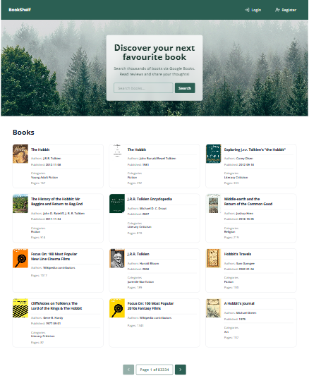
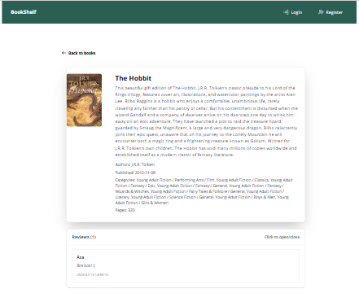
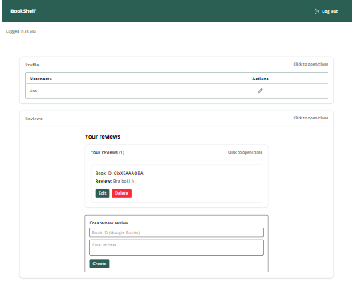
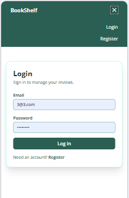
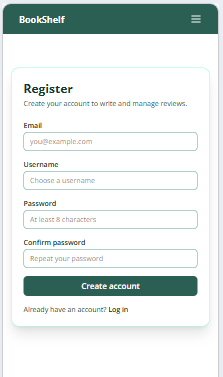

# Book Shelf Project

Book Shelf Project is a web application for searching books, writing and managing reviews, and handling user profiles.  
It features user authentication, integration with Google Books API, and a responsive dashboard for review management.

## ✨ Features
- User authentication (login/register) via Supabase
- CRUD for book reviews
- Profile management
- Integration with Google Books API for book search
- Search and pagination of books using query parameters
- Responsive app for reading and managing reviews

## 🛠️ Tech Stack
- Next.js
- Supabase
- React
- Tailwind CSS

## Installation
1. Clone the project:
   ```
   git clone https://github.com/sali1502/book-shelf-project.git
   ```
2. Navigate to the project folder:
   ```
   cd book-shelf-project
   ```
3. Install dependencies:
   ```
   npm install
   ```
4. Create a `.env.local` file and add your Supabase keys.
5. Start the development server:
   ```
   npm run dev
   ```

## 📸 Screenshots

### Landing page - desktop


### Details page - desktop


### Dashboard - desktop


### Login - mobile


### Register - mobile


## Author
- Name: Åsa Lindskog
- GitHub: [sali1502](https://github.com/sali1502)

## 🚧 Project Status

This project is ongoing and improvements are planned, including:
- Full CRUD for reviews is implemented, but currently book IDs must be entered manually in the review form.
- Planned: Implement a book search feature using the Google Books API, allowing users to select a book and automatically link its ID to the review.
- Planned: Add a dedicated books table in the database to store selected books, and connect reviews to books and users more seamlessly.
- Full CRUD for users (not just updating profile names), which may require admin functionality for user management.

This is a [Next.js](https://nextjs.org) project bootstrapped with [`create-next-app`](https://nextjs.org/docs/app/api-reference/cli/create-next-app).

## Getting Started

First, run the development server:

```bash
npm run dev
# or
yarn dev
# or
pnpm dev
# or
bun dev
```

Open [http://localhost:3000](http://localhost:3000) with your browser to see the result.

You can start editing the page by modifying `app/page.tsx`. The page auto-updates as you edit the file.

This project uses [`next/font`](https://nextjs.org/docs/app/building-your-application/optimizing/fonts) to automatically optimize and load [Geist](https://vercel.com/font), a new font family for Vercel.

## Learn More

To learn more about Next.js, take a look at the following resources:

- [Next.js Documentation](https://nextjs.org/docs) - learn about Next.js features and API.
- [Learn Next.js](https://nextjs.org/learn) - an interactive Next.js tutorial.

You can check out [the Next.js GitHub repository](https://github.com/vercel/next.js) - your feedback and contributions are welcome!

## Deploy on Vercel

The easiest way to deploy your Next.js app is to use the [Vercel Platform](https://vercel.com/new?utm_medium=default-template&filter=next.js&utm_source=create-next-app&utm_campaign=create-next-app-readme) from the creators of Next.js.

Check out our [Next.js deployment documentation](https://nextjs.org/docs/app/building-your-application/deploying) for more details.
